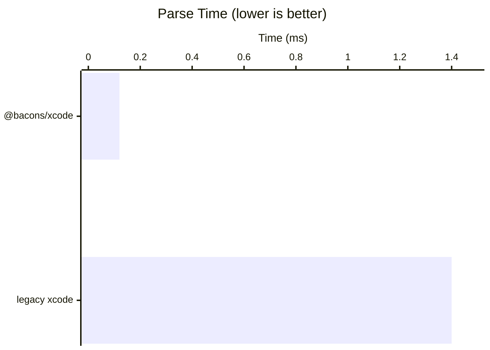

# `@bacons/xcode`

The fastest and most accurate parser for Xcode project files (`.pbxproj`). **11x faster** than the legacy `xcode` package with better error messages and full spec compliance.

```
bun add @bacons/xcode
```

## Performance

Run benchmarks with `bun run bench`.



| Parser | Time (29KB) | Time (263KB) | Throughput |
|--------|-------------|--------------|------------|
| **@bacons/xcode** | **120µs** | **800µs** | **315 MB/s** |
| legacy xcode | 1.4ms | crashes | ~20 MB/s |

### Key Performance Features

- **11.7x faster** than the legacy `xcode` npm package
- Single-pass parsing with no intermediate representation
- Pre-computed lookup tables for character classification
- Handles files that crash the legacy parser

Here is a diagram of the grammar used for parsing:


# Why

The most popular solution for parsing pbxproj files is a very old package by Cordova called [xcode](https://www.npmjs.com/package/xcode).

**But `xcode` has some major issues:**

- Inaccurate parsing: strings can be quoted incorrectly very often, lists often don't work.
- Outdated: values for App Clips, iMessage Sticker packs, etc are missing.
- Untyped: TypeScript is a crutch I proudly support.
- Slow: PEG.js is not very fast ([benchmark](https://chevrotain.io/performance/)).
- Feature Incomplete: Missing the `Data` type (`<xx xx xx>`).

## Format Comparison

Consider the following format comparison.

**Input `.pbxproj`**

```diff
307D28A1123043350040C0FA /* app-icon.png */ = {
  isa = PBXFileReference;
  lastKnownFileType = image.png;
  path = "app-icon.png";
  sourceTree = "<group>";
};
```

**`xcode` output (old)**

```json
{
  "307D28A1123043350040C0FA_comment": "app-icon.png",
  "308D052E1370CCF300D202BF": {
    "isa": "PBXFileReference",
    "lastKnownFileType": "image.png",
    "path": "\"app-icon.png\"",
    "sourceTree": "\"<group>\""
  }
}
```

That same object would look like this in `@bacons/xcode`:

**`@bacons/xcode` output (NEW)**

```json
{
  "308D052E1370CCF300D202BF": {
    "isa": "PBXFileReference",
    "lastKnownFileType": "image.png",
    "path": "app-icon.png",
    "sourceTree": "<group>"
  }
}
```

Notice how you don't need to strip or reapply quotes, you also don't need to filter out comments because the default visitor ignores comments in favor of regenerating them dynamically like Xcode does.

## API

There's a mutable-graph layer which makes it much easier to work with pbxproj.

```ts
import {
  PBXAggregateTarget,
  PBXFrameworksBuildPhase,
  PBXLegacyTarget,
  PBXNativeTarget,
  XcodeProject,
} from "@bacons/xcode";

const project = XcodeProject.open("/path/to/project.pbxproj");

// Get all targets:
project.rootObject.props.targets;
```

Create a Swift file:

```ts
import { PBXBuildFile, PBXFileReference } from "@bacons/xcode";
import path from "path";

// Get `project` from XcodeProject.

const file = PBXBuildFile.create(project, {
  fileRef: PBXFileReference.create(project, {
    path: "MyFile.swift",
    sourceTree: "<group>",
  }),
});

// The file and fileRef will now be injected in the pbxproj `objects` dict.
```

## XCScheme Support

Parse and manipulate Xcode scheme files (`.xcscheme`). Schemes define how targets are built, run, tested, profiled, analyzed, and archived.

### Low-level API

```ts
import * as scheme from "@bacons/xcode/scheme";
import fs from "fs";

// Parse an xcscheme file
const xml = fs.readFileSync(
  "/path/to/Project.xcodeproj/xcshareddata/xcschemes/App.xcscheme",
  "utf-8",
);
const xcscheme = scheme.parse(xml);

// Modify the scheme
xcscheme.buildAction.parallelizeBuildables = true;
xcscheme.launchAction.environmentVariables = [
  { key: "DEBUG", value: "1", isEnabled: true },
];

// Serialize back to XML
const outputXml = scheme.build(xcscheme);
fs.writeFileSync("/path/to/App.xcscheme", outputXml);
```

### High-level API

```ts
import { XcodeProject, XCScheme } from "@bacons/xcode";

// Load project and get schemes
const project = XcodeProject.open("/path/to/project.pbxproj");
const schemes = project.getSchemes();
const appScheme = project.getScheme("App");

// Create a new scheme
const newScheme = XCScheme.create("MyNewScheme");
newScheme.addBuildTarget({
  buildableIdentifier: "primary",
  blueprintIdentifier: "ABC123", // Target UUID
  buildableName: "App.app",
  blueprintName: "App",
  referencedContainer: "container:Project.xcodeproj",
});
newScheme.setLaunchEnvironmentVariable("API_URL", "https://api.example.com");
newScheme.addLaunchArgument("-verbose");

// Save to disk
project.saveScheme(newScheme);

// Create scheme for an existing target
const mainTarget = project.rootObject.props.targets[0];
const targetScheme = project.createSchemeForTarget(mainTarget);
project.saveScheme(targetScheme);
```

### Scheme Management

Parse and build `xcschememanagement.plist` files that control scheme visibility and ordering:

```ts
import * as scheme from "@bacons/xcode/scheme";
import fs from "fs";

const plist = fs.readFileSync("/path/to/xcschememanagement.plist", "utf-8");
const management = scheme.parseManagement(plist);

// Check scheme visibility
console.log(management.SchemeUserState?.["App.xcscheme"]?.isShown);

// Rebuild plist
const output = scheme.buildManagement(management);
```

## XCWorkspace Support

Parse and manipulate Xcode workspace files (`.xcworkspace`). Workspaces group multiple Xcode projects together, commonly used with CocoaPods, monorepos, and multi-project setups.

### Low-level API

```ts
import * as workspace from "@bacons/xcode/workspace";
import fs from "fs";

// Parse a workspace file
const xml = fs.readFileSync(
  "/path/to/MyApp.xcworkspace/contents.xcworkspacedata",
  "utf-8",
);
const ws = workspace.parse(xml);

// Access project references
console.log(ws.fileRefs); // [{ location: "group:App.xcodeproj" }, ...]

// Modify the workspace
ws.fileRefs?.push({ location: "group:NewProject.xcodeproj" });

// Serialize back to XML
const outputXml = workspace.build(ws);
fs.writeFileSync("/path/to/contents.xcworkspacedata", outputXml);
```

### High-level API

```ts
import { XCWorkspace } from "@bacons/xcode";

// Open an existing workspace
const workspace = XCWorkspace.open("/path/to/MyApp.xcworkspace");

// Get all project paths
const projects = workspace.getProjectPaths();
console.log(projects); // ["group:App.xcodeproj", "group:Pods/Pods.xcodeproj"]

// Check if workspace contains a project
if (!workspace.hasProject("NewProject.xcodeproj")) {
  workspace.addProject("NewProject.xcodeproj");
}

// Remove a project
workspace.removeProject("OldProject.xcodeproj");

// Work with groups
const group = workspace.addGroup("Libraries", "group:Libraries");
group.fileRefs?.push({ location: "group:Libraries/MyLib.xcodeproj" });

// Save changes
workspace.save();

// Create a new workspace
const newWorkspace = XCWorkspace.create("MyWorkspace");
newWorkspace.addProject("App.xcodeproj");
newWorkspace.addProject("Pods/Pods.xcodeproj");
newWorkspace.save("/path/to/MyWorkspace.xcworkspace");
```

### Location Types

Workspace file references use location specifiers:

- `group:path` - Relative path from workspace root (most common)
- `self:` - Self-reference (embedded workspace inside `.xcodeproj`)
- `container:path` - Absolute container reference (rare)
- `absolute:path` - Absolute file path

### IDEWorkspaceChecks

Manage `IDEWorkspaceChecks.plist` files that store workspace check states. Introduced in Xcode 9.3, these files prevent Xcode from recomputing checks each time a workspace is opened.

The primary use is suppressing the macOS 32-bit deprecation warning:

```ts
import { XCWorkspace, IDEWorkspaceChecks } from "@bacons/xcode";

// Suppress the 32-bit deprecation warning
const workspace = XCWorkspace.open("/path/to/MyApp.xcworkspace");
workspace.setMac32BitWarningComputed();

// Or work with IDEWorkspaceChecks directly
const checks = IDEWorkspaceChecks.openOrCreate("/path/to/MyApp.xcworkspace");
checks.mac32BitWarningComputed = true;
checks.save();

// Low-level API
import * as workspace from "@bacons/xcode/workspace";

const plist = workspace.parseChecks(plistString);
console.log(plist.IDEDidComputeMac32BitWarning); // true

const output = workspace.buildChecks({ IDEDidComputeMac32BitWarning: true });
```

## XCConfig Support

Parse and manipulate Xcode configuration files (`.xcconfig`). These files define build settings that can be shared across targets and configurations.

### Low-level API

```ts
import * as xcconfig from "@bacons/xcode/xcconfig";
import fs from "fs";

// Parse an xcconfig string
const config = xcconfig.parse(`
  #include "Base.xcconfig"
  PRODUCT_NAME = MyApp
  OTHER_LDFLAGS[sdk=iphoneos*] = -framework UIKit
`);

// Parse from file (resolves #include directives)
const config = xcconfig.parseFile("/path/to/Project.xcconfig");

// Flatten build settings (merges includes, applies conditions)
const allSettings = xcconfig.flattenBuildSettings(config);

// Filter by platform conditions
const iosSettings = xcconfig.flattenBuildSettings(config, {
  sdk: "iphoneos",
  arch: "arm64",
  config: "Release",
});

// Serialize back to xcconfig format
const output = xcconfig.build(config);
fs.writeFileSync("/path/to/Project.xcconfig", output);
```

### Conditional Settings

XCConfig supports conditional settings based on SDK, architecture, and configuration:

```
// SDK-specific settings
OTHER_LDFLAGS[sdk=iphoneos*] = -framework UIKit
OTHER_LDFLAGS[sdk=macosx*] = -framework AppKit

// Architecture-specific settings
ARCHS[arch=arm64] = arm64
ARCHS[arch=x86_64] = x86_64

// Configuration-specific settings
GCC_OPTIMIZATION_LEVEL[config=Debug] = 0
GCC_OPTIMIZATION_LEVEL[config=Release] = s

// Combined conditions
LIBRARY_SEARCH_PATHS[sdk=iphoneos*][arch=arm64] = /usr/lib/arm64
```

### Include Directives

```
// Required include - throws if file not found
#include "Base.xcconfig"

// Optional include - silently ignored if file not found
#include? "Optional.xcconfig"
```

### Variable Expansion

XCConfig supports variable references and the `$(inherited)` keyword:

```
// Reference other settings
PRODUCT_BUNDLE_IDENTIFIER = $(BUNDLE_ID_PREFIX).$(PRODUCT_NAME:lower)

// Inherit from included files
OTHER_LDFLAGS = $(inherited) -framework UIKit
```

## XCSharedData Support

Access and manipulate shared data directories (`xcshareddata`) which contain schemes, breakpoints, and workspace settings that are intended for version control.

### High-level API

```ts
import { XcodeProject, XCSharedData } from "@bacons/xcode";

// Get shared data from a project
const project = XcodeProject.open("/path/to/project.pbxproj");
const sharedData = project.getSharedData();

// Access schemes
const schemes = sharedData.getSchemes();
const appScheme = sharedData.getScheme("App");

// Access breakpoints
if (sharedData.breakpoints) {
  console.log(sharedData.breakpoints.breakpoints?.length);
}

// Access workspace settings
if (sharedData.workspaceSettings) {
  console.log(sharedData.workspaceSettings.PreviewsEnabled);
}

// Modify and save
sharedData.workspaceSettings = {
  PreviewsEnabled: true,
  IDEWorkspaceSharedSettings_AutocreateContextsIfNeeded: false,
};
sharedData.save();
```

### Breakpoints API

Parse and build Xcode breakpoint files (`Breakpoints_v2.xcbkptlist`):

```ts
import * as breakpoints from "@bacons/xcode/breakpoints";
import fs from "fs";

// Parse breakpoint file
const xml = fs.readFileSync(
  "/path/to/xcshareddata/xcdebugger/Breakpoints_v2.xcbkptlist",
  "utf-8",
);
const list = breakpoints.parse(xml);

// Access breakpoints
for (const bp of list.breakpoints ?? []) {
  console.log(bp.breakpointExtensionID); // "Xcode.Breakpoint.FileBreakpoint"
  console.log(bp.breakpointContent?.filePath);
  console.log(bp.breakpointContent?.startingLineNumber);
}

// Add a new breakpoint
list.breakpoints?.push({
  breakpointExtensionID: "Xcode.Breakpoint.FileBreakpoint",
  breakpointContent: {
    uuid: "new-uuid",
    shouldBeEnabled: true,
    filePath: "MyApp/ViewController.swift",
    startingLineNumber: "42",
    endingLineNumber: "42",
    actions: [
      {
        actionExtensionID: "Xcode.BreakpointAction.DebuggerCommand",
        actionContent: { consoleCommand: "po self" },
      },
    ],
  },
});

// Serialize back to XML
const outputXml = breakpoints.build(list);
```

### Workspace Settings API

Parse and build workspace settings files (`WorkspaceSettings.xcsettings`):

```ts
import * as settings from "@bacons/xcode/settings";
import fs from "fs";

// Parse settings file
const plist = fs.readFileSync(
  "/path/to/xcshareddata/WorkspaceSettings.xcsettings",
  "utf-8",
);
const config = settings.parse(plist);

console.log(config.BuildSystemType); // "Original" or "New"
console.log(config.PreviewsEnabled); // true/false

// Modify and save
config.PreviewsEnabled = true;
config.IDEWorkspaceSharedSettings_AutocreateContextsIfNeeded = false;

const outputPlist = settings.build(config);
fs.writeFileSync("/path/to/WorkspaceSettings.xcsettings", outputPlist);
```

## Solution

- Uses a hand-optimized single-pass parser that is 11x faster than the legacy `xcode` package (which uses PEG.js).
- This project supports the Data type `<xx xx xx>`.
- Better error messages with line and column numbers.
- This implementation is more stable since we follow the [best guess pbxproj spec][spec].
- String parsing is the trickiest part. This package uses a port of the actual [CFOldStylePlist parser](http://www.opensource.apple.com/source/CF/CF-744.19/CFOldStylePList.c) which is an approach first used at scale by the [CocoaPods team](https://github.com/CocoaPods/Nanaimo/blob/master/lib/nanaimo/unicode/next_step_mapping.rb) (originally credited to [Samantha Marshall](https://github.com/samdmarshall/pbPlist/blob/346c29f91f913d35d0e24f6722ec19edb24e5707/pbPlist/StrParse.py#L197)).

# How

The parsing is very simple (simplicity is the key).

`pbxproj` is an "old-style plist" (or ASCII Plist), this means it should be possible to represent it as any other static configuration file type like JSON or XML.

We support the following types: `Object`, `Array`, `Data`, `String`. Notably, we avoid dealing with `Integer`, `Double`, Boolean since they appear to not exist in the format.

# TODO

- [x] Reading.
- [x] Writing.
- [x] Escaping scripts and header search paths.
- [x] Generating UUIDs.
- [x] Reference-type API.
- [x] Build setting parsing.
- [x] xcscheme support.
- [x] Benchmarks (`bun run bench`).
- [x] xcworkspace support.
- [x] **XCConfig** Parsing: `.xcconfig` file parsing with `#include` support and build settings flattening.
- [x] **XCSharedData**: Shared project data directory (schemes, breakpoints, workspace settings).
- [x] **XCSchemeManagement**: Scheme ordering, visibility, and management plist.
- [x] **WorkspaceSettings**: (`xcshareddata/WorkspaceSettings.xcsettings`) Derived data location, build system version, auto-create schemes setting.
- [x] **XCBreakpointList**: (`xcshareddata/xcdebugger/Breakpoints_v2.xcbkptlist`) Shared debugger breakpoints (file, symbolic, exception breakpoints).
- [ ] Create robust xcode projects from scratch.
- [ ] Skills.
- [ ] Import from other tools.
- [ ] **XCUserData**: (`xcuserdata/<user>.xcuserdatad/`) Per-user schemes, breakpoints, UI state.
- [x] **IDEWorkspaceChecks**: (`xcshareddata/IDEWorkspaceChecks.plist`) Workspace check state storage (e.g., 32-bit deprecation warning).

# Docs

Docs are in the works. For now, you can refer to the [types](./src/types.ts) and the estimated [`pbxproj` spec][spec].

The API will change in the future, for now we have two methods:

```ts
import {
  /** Given a stringified `pbxproj`, return a JSON representation of the object. */
  parse,
  /** Given a JSON representation of a `pbxproj`, return a `.pbxproj` string that can be parsed by Xcode. */
  build,
} from "@bacons/xcode/json";

import fs from "fs";
import path from "path";

const pbxproj = parse(fs.readFileSync("/path/to/project.pbxproj"));

const pbxprojString = build(pbxproj);
```

- `PBXVariantGroup` is a localized `PBXGroup`.

## File Path Resolution

Files will have an attribute `sourceTree` which indicates how the file path should be resolved.

- `BUILT_PRODUCTS_DIR`: Paths are relative to the built products directory.
- `DEVELOPER_DIR`: Paths are relative to the developer directory.
- `SOURCE_ROOT`: Paths are relative to the project.
- `SDKROOT`: Paths are relative to the SDK directory.
- `<group>`: Paths are relative to the group.
- `<absolute>`: Source is an absolute path.

For example, a file object like:

```json
{
  "isa": "PBXFileReference",
  "name": "AppDelegate.m",
  "path": "multitarget/AppDelegate.m",
  "sourceTree": "<group>"
}
```

Indicates that the `path` "multitarget/AppDelegate.m" is relative to `sourceTree` "<group>". We need to check the containing `PBXGroup`'s `path` (only defined when the group is linked to a directory in the file system). Groups can live inside of other groups so this process is recursive.

## Versioning

Certain values loosely map to each other. For instance the top-level `objectVersion` (which indicates the versioning used for the objects in the top-level `objects` dictionary), maps to the `rootObject` -> `PBXProject`'s `compatibilityVersion` string. Here is an up-to-date mapping (May 2022):

| `PBXProject.compatibilityVersion` | `XcodeProject.objectVersion` |
| --------------------------------- | ---------------------------- |
| `'Xcode 16.0'`                    | `70`                         |
| `'Xcode 15.0'`                    | `60`                         |
| `'Xcode 14.0'`                    | `56`                         |
| `'Xcode 13.0'`                    | `55`                         |
| `'Xcode 12.0'`                    | `54`                         |
| `'Xcode 11.4'`                    | `53`                         |
| `'Xcode 11.0'`                    | `52`                         |
| `'Xcode 10.0'`                    | `51`                         |
| `'Xcode 9.3'`                     | `50`                         |
| `'Xcode 8.0'`                     | `48`                         |
| `'Xcode 6.3'`                     | `47`                         |
| `'Xcode 3.2'`                     | `46`                         |
| `'Xcode 3.1'`                     | `45`                         |

[spec]: http://www.monobjc.net/xcode-project-file-format.html

# Attribution

- [Best guess API doc][spec].
- [CocoaPods/Xcodeproj](https://github.com/CocoaPods/Xcodeproj/).
